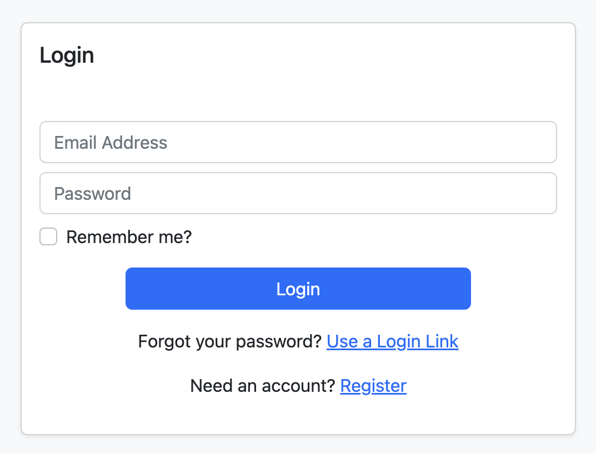

### CSC1106 Web Programming Group 7: Form Builder Library 🤑
2200692 Pang Zi Jian Adrian <br>
2200795 Ashley Tay Yong Jun <br>
2200959 Peter Febrianto Afandy <br>
2201018 Jeffrey Yap Wan Lin <br>
2201052 Nur Hakeem Bin Azman <br>
2201159 Ryan Lai Wei Shao

### Library Overview
The custom form builder library consists of two main components, each playing a crucial role in enabling the creation and utilization of customizable forms within generic web applications. This system design empowers developers to create dynamic and user-friendly forms, harnessing the full potential of the custom library. To leverage the functionalities of the custom library, programmers are required to set up both components within their web application environment. 


The custom CI4 library serves as the backbone of our project, offering a comprehensive collection of reusable classes and functions specifically designed for the creation, customization, and handling of forms. With this library, programmers gain the ability to finely tailor the forms to match their web application's unique requirements, thus enhancing user experience and engagement. To store the structures and responses received for the generated forms, we employed a MySQL relational database. The decision to utilize MySQL is driven by its exceptional performance, scalability, maturity, reliability, and robust features, ensuring efficient data management for the forms.

<u>Database Design</u><br>
The relational database consists of two tables, Form and Response. The Form table is used to store the serialized structure of forms, along with their date of creation, version number for auditing, and custom serialised rules for the form template. The Response table is used to store serialized responses provided by end users of these forms.


Programmers are expected to maintain user details independently since such information will not be stored by the library. The Response table includes a `User` field to allow programmers to identify users who have submitted a form response. This intentional separation of information ensures that the library remains lightweight while providing programmers with the flexibility to define their own database design to complement the library. Additionally, migration files are included for each table to facilitate fast deployment of the custom library.

<u>Library Design</u><br>
The library consists of the following components (more details on each function can be viewed in our Notion documentation [here](https://ptrpfa.notion.site/5959fa04a29c483fbb2190002c2016e5?v=0f3e85b64ee2489bbae6665707c43e3c&pvs=4)):


### Submission Files
```
README.md (this file)

docs/ (images for documentation)

formgenerator/ (Admin web application for managing Forms)

library/ (empty CI4 web application for you to start development!)

```

### Installation Instructions
1. If you are building a web application from scratch, create a copy of the `library/` project which contains all functions for this Form Builder library.
    ```
    cp -r library <project name>
    ```
2. Modify the database credentials in the ``.env`` file. By default, it is configured to connect to our cloud MySQL database.
3. Run this command to create the database schema in your configured database: 
    ```
    php spark db:create FormBuilder
    ```
4. Run this command to create all necessary tables in your database: 
    ```
    php spark migrate --all
    ```
5. Run these commands to ensure all dependencies defined in our `composer.json` file are installed and updated:
    ```
    composer install
    composer update
    ```
6. Run this command to start the web application: 
    ```
    php spark serve
    ```
7. If you plan on using CI4 Shield for authentication, create an account to login by navigating to `/login`.
    
8. Start coding! Please refer to the documentation provided to learn how to use our library, or click [here](https://ptrpfa.notion.site/5959fa04a29c483fbb2190002c2016e5?v=0f3e85b64ee2489bbae6665707c43e3c&pvs=4) to view our shared Notion documentation.